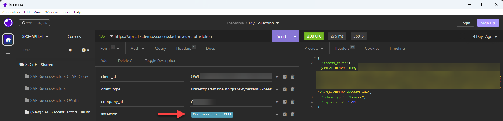
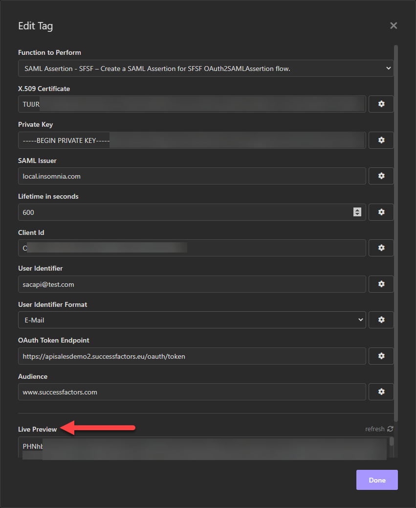

# insomnia-plugin-sfsf-samlassertion
This is an [Insomnia](https://insomnia.rest/) plugin for generating SAML Assertions required to obtain OAuth tokens from SAP SuccessFactors API's, as described in the _SAP SuccessFactors HXM Suite OData API: Developer Guide (V2)_ documentation [Generating a SAML Assertion](https://help.sap.com/docs/SAP_SUCCESSFACTORS_PLATFORM/d599f15995d348a1b45ba5603e2aba9b/4e27e8f6ae2748ab9f23228dd6a31b06.html?locale=en-US) and the blog [SAML assertions for SAP SuccessFactors OAuth 2.0 API’s: Handling of User Identifiers](https://blogs.sap.com/2023/04/18/saml-assertions-for-sap-successfactors-oauth-2.0-apis-handling-of-user-identifiers/). Based on the npm package [saml](https://www.npmjs.com/package/saml) from [auth0](https://github.com/auth0).

SAP Community Blog with more details about the plugin usage: [https://blogs.sap.com/2023/02/02/testing-successfactors-apis-how-to-use-insomnia-to-automate-the-generation-of-saml-assertions/](https://blogs.sap.com/2023/02/02/testing-successfactors-apis-how-to-use-insomnia-to-automate-the-generation-of-saml-assertions/)

After successfully installing the plugin, the [Template Tag](https://docs.insomnia.rest/insomnia/template-tags) _SAML Assertion - SFSF_ will be available and the following parameters have to be entered to generate a SAML Assertion:

- *X.509 Certificate*: Public certificate corresponding to the key pair used for client configuration in SAP SuccessFactors. 
- *Private Key*: Private key of the key pair that will be used to sign the SAML assertion.
- *SAML Issuer*: Name of the IdP issuing the SAML Assertion. The proposed value _local.insomnia.com_ should be a good starting point.
- *Lifetime in seconds*: Lifetime of the SAML Assertion in seconds.
- *Client Id*: Registered Client Id in SAP SuccessFactors, also called as _API key_ in the SFSF Documentation.
- *User Identifier* *(Changed on April/2023)*: User identifier to be used to access the SAP SuccessFactors API's.
- *User Identifier Format* *(Added on April/2023)*: Type of *User Identifier* informed for SAML assertion. It can be one of the three following types: *User ID*, *Username* or *E-Mail*. Check the blog [SAML assertions for SAP SuccessFactors OAuth 2.0 API’s: Handling of User Identifiers](https://blogs.sap.com/2023/04/18/saml-assertions-for-sap-successfactors-oauth-2.0-apis-handling-of-user-identifiers/) to better understand which of these options best suits your test needs.
- *OAuth Token Endpoint*: The URL of the API server from which you request the OAuth token.
- *Audience*: Value used to tag the SAML assertion. The proposed value _www.successfactors.com_ should be a good starting point.

Add the _Template Tag_ and configure it where the SAML assertion is required. The SAML Assertion will be generated and returned in the Base64 format.

